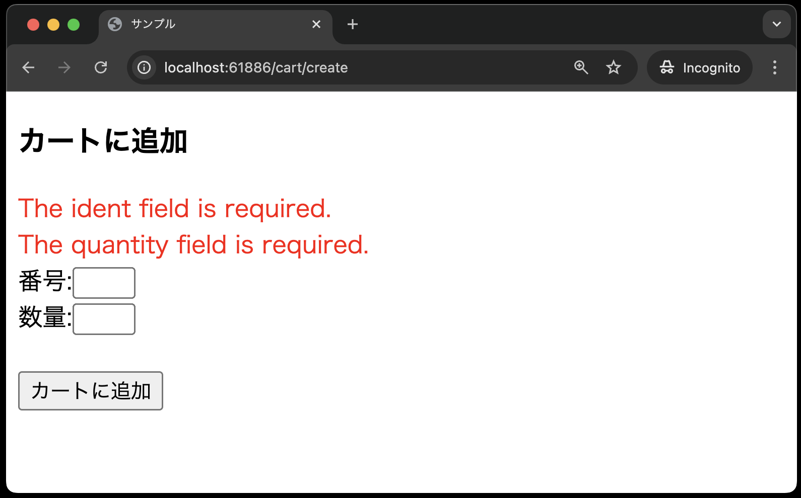
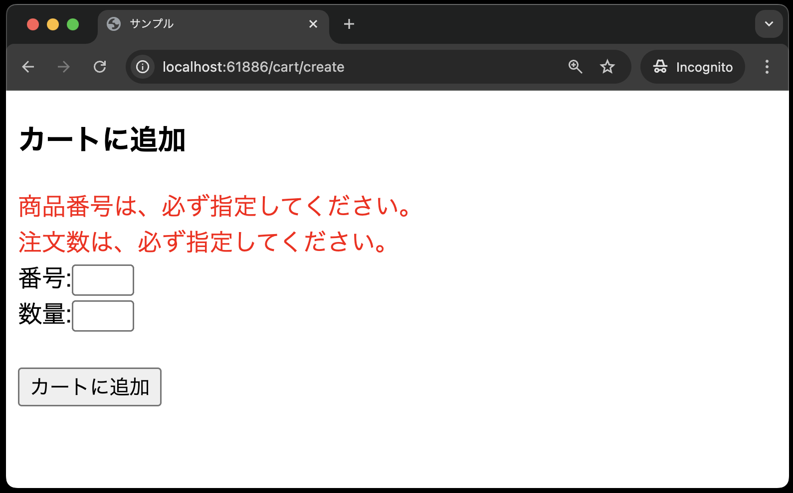

# 付録とまとめ

## 付録(バリデーションの日本語化)

現状のままでは、バリデーションエラーメッセージが英語で表示されます。
確認してみましょう。

1. `http://localhost:{ポート番号}/cart/create`にアクセスし、商品番号と数量を入力せずに「カートに追加」ボタンをクリック
2. 以下のような英語のエラーメッセージが表示される<br>


これを日本語に変更するためには、以下のような手順が必要です。

1. `config/app.php`の`locale`を`ja`に変更する
2. `.env`の`APP_LOCALE`を`ja`に変更する
3. `lang`ディレクトリを作成するために,`php artisan lang:publish`を実行する
4. `lang`ディレクトリ内の`en`ディレクトリをディレクトリをコピーし、コピーしたものを`ja`にリネームする
5. `lang/ja/validation.php`の内容を以下に書き換える
   
   ```php
    <?php

    return [

        /*
        |--------------------------------------------------------------------------
        | Validation Language Lines
        |--------------------------------------------------------------------------
        |
        | The following language lines contain the default error messages used by
        | the validator class. Some of these rules have multiple versions such
        | as the size rules. Feel free to tweak each of these messages here.
        |
        */

        'accepted'        => ':attributeを承認してください。',
        'active_url'      => ':attributeは、有効なURLではありません。',
        'after'           => ':attributeには、:dateより後の日付を指定してください。',
        'after_or_equal'  => ':attributeには、:date以降の日付を指定してください。',
        'alpha'           => ':attributeには、アルファベッドのみ使用できます。',
        'alpha_dash'      => ":attributeには、英数字('A-Z','a-z','0-9')とハイフンと下線('-','_')が使用できます。",
        'alpha_num'       => ":attributeには、英数字('A-Z','a-z','0-9')が使用できます。",
        'array'           => ':attributeには、配列を指定してください。',
        'before'          => ':attributeには、:dateより前の日付を指定してください。',
        'before_or_equal' => ':attributeには、:date以前の日付を指定してください。',
        'between'         => [
            'numeric' => ':attributeには、:minから、:maxまでの数字を指定してください。',
            'file'    => ':attributeには、:min KBから:max KBまでのサイズのファイルを指定してください。',
            'string'  => ':attributeは、:min文字から:max文字にしてください。',
            'array'   => ':attributeの項目は、:min個から:max個にしてください。',
        ],
        'boolean'              => ":attributeには、'true'か'false'を指定してください。",
        'confirmed'            => ':attributeと:attribute確認が一致しません。',
        'date'                 => ':attributeは、正しい日付ではありません。',
        'date_equals'          => ':attributeは:dateに等しい日付でなければなりません。',
        'date_format'          => ":attributeの形式は、':format'と合いません。",
        'different'            => ':attributeと:otherには、異なるものを指定してください。',
        'digits'               => ':attributeは、:digits桁にしてください。',
        'digits_between'       => ':attributeは、:min桁から:max桁にしてください。',
        'dimensions'           => ':attributeの画像サイズが無効です',
        'distinct'             => ':attributeの値が重複しています。',
        'email'                => ':attributeは、有効なメールアドレス形式で指定してください。',
        'ends_with'            => 'The :attribute must end with one of the following: :values',
        'exists'               => '選択された:attributeは、有効ではありません。',
        'file'                 => ':attributeはファイルでなければいけません。',
        'filled'               => ':attributeは必須です。',
        'gt'                   => [
            'numeric' => ':attributeは、:valueより大きくなければなりません。',
            'file'    => ':attributeは、:value KBより大きくなければなりません。',
            'string'  => ':attributeは、:value文字より大きくなければなりません。',
            'array'   => ':attributeの項目数は、:value個より大きくなければなりません。',
        ],
        'gte'                  => [
            'numeric' => ':attributeは、:value以上でなければなりません。',
            'file'    => ':attributeは、:value KB以上でなければなりません。',
            'string'  => ':attributeは、:value文字以上でなければなりません。',
            'array'   => ':attributeの項目数は、:value個以上でなければなりません。',
        ],
        'image'                => ':attributeには、画像を指定してください。',
        'in'                   => '選択された:attributeは、有効ではありません。',
        'in_array'             => ':attributeが:otherに存在しません。',
        'integer'              => ':attributeには、整数を指定してください。',
        'ip'                   => ':attributeには、有効なIPアドレスを指定してください。',
        'ipv4'                 => ':attributeはIPv4アドレスを指定してください。',
        'ipv6'                 => ':attributeはIPv6アドレスを指定してください。',
        'json'                 => ':attributeには、有効なJSON文字列を指定してください。',
        'lt'                   => [
            'numeric' => ':attributeは、:valueより小さくなければなりません。',
            'file'    => ':attributeは、:value KBより小さくなければなりません。',
            'string'  => ':attributeは、:value文字より小さくなければなりません。',
            'array'   => ':attributeの項目数は、:value個より小さくなければなりません。',
        ],
        'lte'                  => [
            'numeric' => ':attributeは、:value以下でなければなりません。',
            'file'    => ':attributeは、:value KB以下でなければなりません。',
            'string'  => ':attributeは、:value文字以下でなければなりません。',
            'array'   => ':attributeの項目数は、:value個以下でなければなりません。',
        ],
        'max'                  => [
            'numeric' => ':attributeには、:max以下の数字を指定してください。',
            'file'    => ':attributeには、:max KB以下のファイルを指定してください。',
            'string'  => ':attributeは、:max文字以下にしてください。',
            'array'   => ':attributeの項目は、:max個以下にしてください。',
        ],
        'mimes'                => ':attributeには、:valuesタイプのファイルを指定してください。',
        'mimetypes'            => ':attributeには、:valuesタイプのファイルを指定してください。',
        'min'                  => [
            'numeric' => ':attributeには、:min以上の数字を指定してください。',
            'file'    => ':attributeには、:min KB以上のファイルを指定してください。',
            'string'  => ':attributeは、:min文字以上にしてください。',
            'array'   => ':attributeの項目は、:min個以上にしてください。',
        ],
        'not_in'               => '選択された:attributeは、有効ではありません。',
        'not_regex'            => ':attributeの形式が無効です。',
        'numeric'              => ':attributeには、数字を指定してください。',
        'password'             => ':attributeが間違っています',
        'present'              => ':attributeが存在している必要があります。',
        'regex'                => ':attributeには、有効な正規表現を指定してください。',
        'required'             => ':attributeは、必ず指定してください。',
        'required_if'          => ':otherが:valueの場合、:attributeを指定してください。',
        'required_unless'      => ':otherが:values以外の場合、:attributeを指定してください。',
        'required_with'        => ':valuesが指定されている場合、:attributeも指定してください。',
        'required_with_all'    => ':valuesが全て指定されている場合、:attributeも指定してください。',
        'required_without'     => ':valuesが指定されていない場合、:attributeを指定してください。',
        'required_without_all' => ':valuesが全て指定されていない場合、:attributeを指定してください。',
        'same'                 => ':attributeと:otherが一致しません。',
        'size'                 => [
            'numeric' => ':attributeには、:sizeを指定してください。',
            'file'    => ':attributeには、:size KBのファイルを指定してください。',
            'string'  => ':attributeは、:size文字にしてください。',
            'array'   => ':attributeの項目は、:size個にしてください。',
        ],
        'starts_with'          => ':attributeは、次のいずれかで始まる必要があります。:values',
        'string'               => ':attributeには、文字を指定してください。',
        'timezone'             => ':attributeには、有効なタイムゾーンを指定してください。',
        'unique'               => '指定の:attributeは既に使用されています。',
        'uploaded'             => ':attributeのアップロードに失敗しました。',
        'url'                  => ':attributeは、有効なURL形式で指定してください。',
        'uuid'                 => ':attributeは、有効なUUIDでなければなりません。',

        /*
        |--------------------------------------------------------------------------
        | Custom Validation Language Lines
        |--------------------------------------------------------------------------
        |
        | Here you may specify custom validation messages for attributes using the
        | convention "attribute.rule" to name the lines. This makes it quick to
        | specify a specific custom language line for a given attribute rule.
        |
        */

        'custom' => [
            'attribute-name' => [
                'rule-name' => 'custom-message',
            ],
        ],

        /*
        |--------------------------------------------------------------------------
        | Custom Validation Attributes
        |--------------------------------------------------------------------------
        |
        | The following language lines are used to swap our attribute placeholder
        | with something more reader friendly such as "E-Mail Address" instead
        | of "email". This simply helps us make our message more expressive.
        |
        */

        'attributes' => [
            'ident' => '商品番号',
            'quantity' => '注文数',
        ],
    ];
    ```

    **【解説】**

    上記は、元々`lang/en/validation.php`に記述されていた内容を、日本語に変更したものです。

    `attributes`キーには、バリデーションエラーメッセージに表示するカラム名を指定します。
    ここでは、`ident`カラムには`商品番号`、`quantity`カラムには`注文数`というカラム名を指定しています。

6. バリデーションエラーメッセージが日本語に変更されていることを確認する
   

## まとめ

本章では、CRUDのうち、Createの機能を実装しました。(※Readの機能は既に実装済みです)
次章では、CRUDの残りのUpdateとDeleteの機能を実装します。