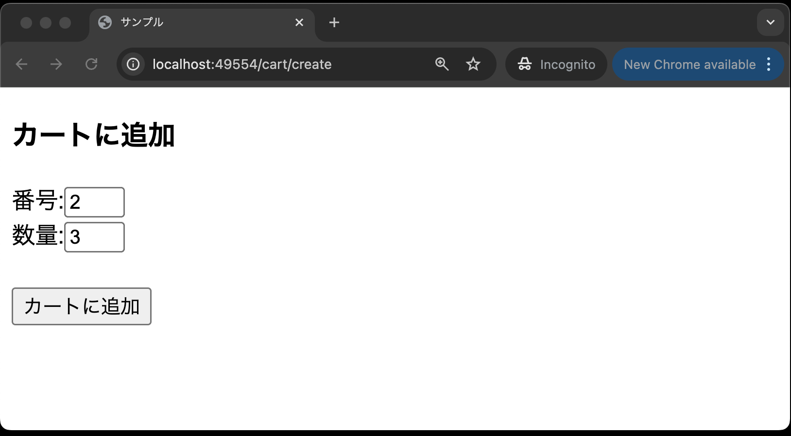

# ルーティング等の修正

## ルーティングの修正

`CartController`の`create`メソッドにアクセスするためのルーティングを追加します。
また、併せてカート情報を登録するための`store`メソッドにアクセスするためのルーティングも追加します。

**routes/web.php**を以下のように修正してください。

```php
<?php

use Illuminate\Support\Facades\Route;
use App\Http\Controllers\ItemController;
use App\Http\Controllers\CartController; // 追加

// 途中省略

// --- 以下を追加 ---
Route::get('cart/create', [CartController::class, 'create'])->name('cart.create');
Route::post('cart', [CartController::class, 'store'])->name('cart.store');
// --- ここまで ---
```

**【解説】**

`use App\Http\Controllers\CartController;`: <br>
`CartController`クラスを使うための宣言です。

`Route::get('cart', [CartController::class, 'create'])->name('cart.create');`: <br>
`cart`というURLに`GET`リクエストが送信された場合、`CartController`クラスの`create`メソッドが呼び出されるように設定しています。

`Route::post('cart', [CartController::class, 'store'])->name('cart.store');`: <br>
`cart`というURLに`POST`リクエストが送信された場合、`CartController`クラスの`store`メソッドが呼び出されるように設定しています。

## コントローラの修正(storeメソッドの追加)

次に、カート情報を登録するための`store`メソッドを作成します。

**app/Http/Controllers/CartController.php**

```php
<?php
namespace App\Http\Controllers;

use Illuminate\Http\Request;
use App\Models\Cart;

class CartController extends Controller
{
    public function create()
    {
        return view('cart.create');
    }

    // --- 以下を追加 ---

    public function store(Request $request)
    {
        $validated = $request->validate([
            'ident' => 'required|integer',
            'quantity' => 'required|integer',
        ]);
        $cart = Cart::create($validated);
        $request->session()->flash('message', 'カートに追加しました');
        return back();
    }
    // --- ここまで ---
}
```

**【解説】**

`public function store`: <br>
Laravelでは、コントローラに記述する`store` メソッドは、「データを新規登録するためのメソッド」として一般的に使われます。

`$validated = $request->validate([`<br>
`validate`メソッドは、リクエストデータのバリデーションを行うメソッドです。
第1引数には、バリデーションルールを指定します。
ここでは、`ident`カラムと`quantity`カラムに対して、`required`と`integer`のバリデーションルールを設定しています。
`required`は、必須入力を指定するバリデーションルールです。
`integer`は、数値型の入力を指定するバリデーションルールです。

```note
**【補足(バリデーションについて)】**
バリデーションとは、データの正当性を検証することです。
バリデーションを行うことで、不正なデータがデータベースに登録されることを防ぐことができます。
今回は、クライアント側でもnumber型の入力を制限していますが、サーバ側でもバリデーションを行うことで、より安全なデータベース操作を実現します。
```

`$cart = Cart::create($validated);`: <br> 
`create`メソッドは、モデルを新規登録するメソッドです。
ここでは、`Cart`モデルを使って、`cart`テーブルにデータを新規登録しています。

`$request->session()->flash('message', 'カートに追加しました');`: <br>
`session`メソッドは、セッションを扱うメソッドです。
`flash`メソッドは、セッションに一時的なデータを保存するメソッドです。
ここでは、`message`というキーで`カートに追加しました`というメッセージをセッションに保存しています。

`return back();`: <br>
`back`関数は、直前のページにリダイレクトする関数です。

## ビューの修正(カート追加画面)

先ほどの`create.blade.php`に、以下のメッセージを表示するためのコードを追加します。

**resources/views/cart/create.blade.php**


```php
<!DOCTYPE html>
<html lang="ja">
<head>
<meta charset="UTF-8">
<meta name="viewport" content="width=device-width, initial-scale=1.0">
<title>サンプル</title>
</head>
<body>
    <h3>カートに追加</h3>

    <!-- 以下を追加 -->

    <!-- 登録成功時のメッセージを表示 -->
    @if (session('message'))
        <font color="red">{{ session('message') }}</font>
    @endif

    <!-- バリデーションエラーメッセージを表示 -->
    @if ($errors->any())
        @foreach ($errors->all() as $error)
            <font color="red">{{ $error }}</font><br>
        @endforeach
    @endif

    <!-- ここまで -->

    <!-- action属性にルーティング名を指定 -->
    <form action="{{ route('cart.store') }}" method="POST">
    <!-- ここまで -->
    @csrf
    番号:<input type="number" name="ident" min="1" max="15"><br>
    数量:<input type="number" name="quantity" min="1" max="10"><br><br>
    <input type="submit" value="カートに追加">
    </form>
</body>
</html>
```



**【解説】**

`@if (session('message'))`: <br>
`session`関数は、セッションに保存されたデータを取得する関数です。
ここでは、`message`というキーで保存されたデータがあるかどうかを判定しています。

`@if ($errors->any()) ... @endif`: <br>
`$errors`変数は、バリデーションエラーメッセージを取得する変数です。
`$errors->any()`メソッドは、バリデーションエラーメッセージがあるかどうかを判定するメソッドです。
バリデーションエラーメッセージがある場合は、`$errors->all()`メソッドで全てのエラーメッセージを取得し、`foreach`文で1つずつ表示しています。

## 動作確認

1. VSCode上で、`Ctrl+Shift+P`(Macの場合は`Cmd+Shift+P`)を押し、コンテナを起動する(既に起動しているなら不要)
2. VSCode上で、`Ctrl+J`(Macの場合は`Cmd+J`)を押し、画面下部のポートをクリックし、地球儀マークをクリックする<br>
   
3. ブラウザのアドレスバーの末尾に`/cart/create`を追加し、Enterキーを押す
4. カート追加フォームが表示されるので、商品番号と数量を入力し、「カートに追加」ボタンをクリック<br>
   <br>
5. 追加されたら、メッセージが表示される<br>
   <br>
6. phpMyAdminで`cart`テーブルを確認し、追加されたデータをphpmyadminで確認する<br>
<br>